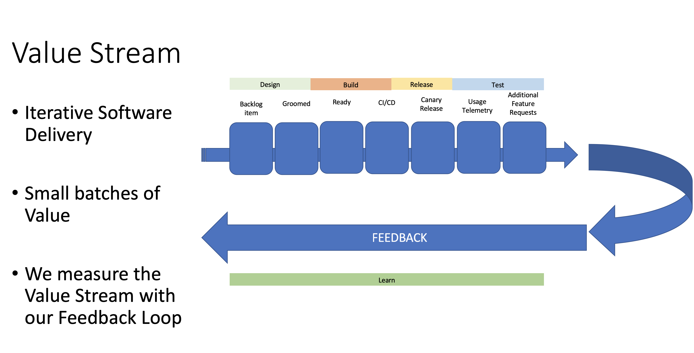

# cloudbuild-demo

a project to demonstrate ci-cd with cloud build and deploys on GKE  

demo application from https://github.com/paulbouwer/hello-kubernetes/  

# Continious Integration
- fast feedback for breaking changes
- basic merge of features into main branch, and limited (and fasst) unit tests, linting, and feedback about the format of the changes

# Longer running




# local dev

git clone  
docker build . -t hello-k8s  
docker run  -p 8181:8080 hello-k8s  
http://127.0.0.1:8181/ 

# 


# devOps Principles 
Teams modeled around business domain  
Culture of automation  
Hide implementation details  
De centralize all things  
Deploy independently  
Consumer first  
Isolate failure  

# Andy Powell Suggestions
- Guard rails vs. road blocks == protect releases but don't add manual steps/approavals just for confidence (use tests and automation instead to build confidence)  
- Build the dev, qa, stage, production environment deployments before your write code  
- Share the responsibility of the CI/CD pipeline care and feeding  
- Try new things in the CI/CD pipeline, CI/CD has a lot of moving parts and is used a lot, so take risks with it and learn how to support new features in CI/CD before going to higher environments  


# encrypt env file
```
gcloud kms encrypt \
  --plaintext-file=.env \
  --ciphertext-file=.env.enc \
  --location=global \
  --keyring=cloudbuild-demo-keyring \
  --key=cloudbuild-demo-env
```

.
